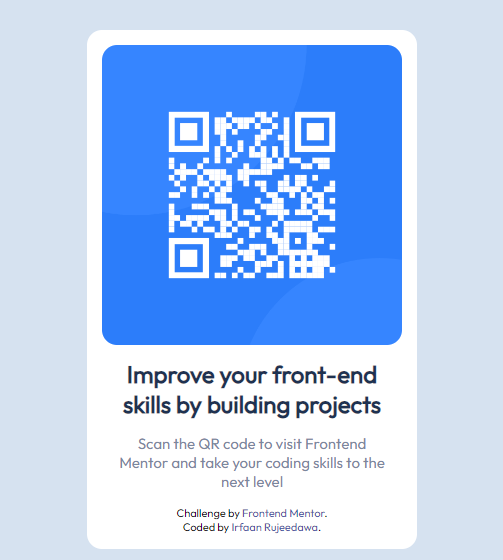

# Frontend Mentor - QR code component solution

This is a solution to the [QR code component challenge on Frontend Mentor](https://www.frontendmentor.io/challenges/qr-code-component-iux_sIO_H). Frontend Mentor challenges help you improve your coding skills by building realistic projects. 

## Table of contents

- [Overview](#overview)
  - [Screenshot](#screenshot)
  - [Links](#links)
- [My process](#my-process)
  - [Built with](#built-with)
  - [What I learned](#what-i-learned)
  - [Continued development](#continued-development)
  - [Useful resources](#useful-resources)
- [Author](#author)


## Overview


### Screenshot




### Links

- Solution URL: [Add solution URL here](https://github.com/Ir-faan/QR-Code-Component)
- Live Site URL: [Add live site URL here](https://ir-faan.github.io/QR-Code-Component/)

## My process

### Built with

- Semantic HTML5 markup
- CSS custom properties
- Flexbox
- CSS Grid


### What I learned

I learnt how to use media queries in CSS to style a webpage according to the size of the display screen.

```css
@media screen and (min-width: 375px) and (max-width: 375px) {
    .container {
      width:250px;
    }

    h2{
        font-size:1.3em;
    }
}
```

### Continued development

I want to persue my researches and learning about media queries. I find it really important that a webpage is designed in such a way that it is viewable both on desktop devices and mobile phones. The use of media queries allows us to scale a webpage accordingly to make the webpage scalableon any devices we want.

For further learning, i would like to start using keyframes to include animation in my project. The use of animation makes a webpage much more user friendly to end-users which will be more keen to use the website. I would also like to start learning javascript to make a website smoother and more user-friendly as well.

### Useful resources

- [Example resource 1](https://www.overapi.com) - This site helped me to quickly look at the different properties of css i needed. It is a cheatsheet for a variety of technologies.

## Author

- Frontend Mentor - [@yourusername](https://www.frontendmentor.io/profile/ir-faan)

